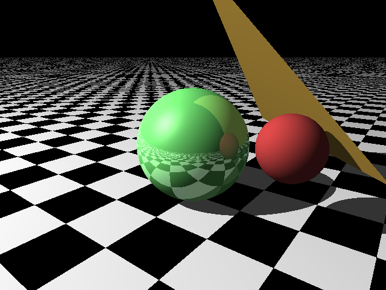

# RayTracer
Learning how to write a simple raytracer. No graphics library, writes output directly to file. 

## TODO:
1. Cleanup
2. More shapes
3. Load scene config from file
4. Render to screen directly
5. Use GPU/shaders